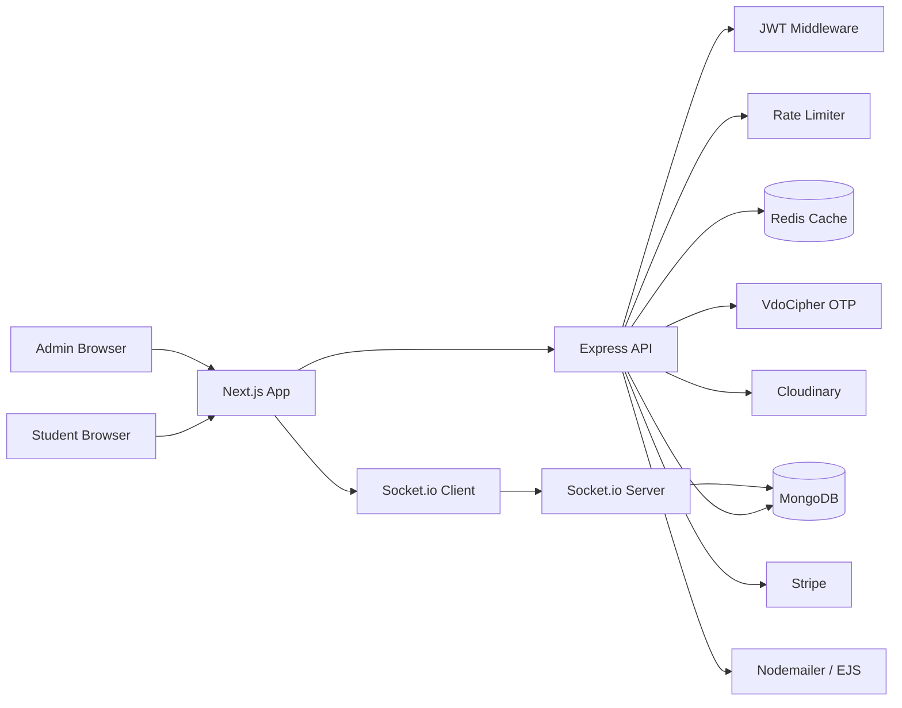
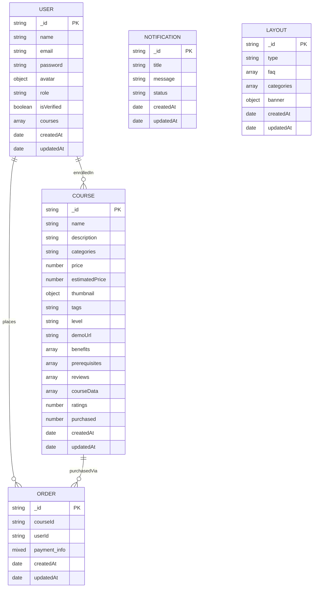
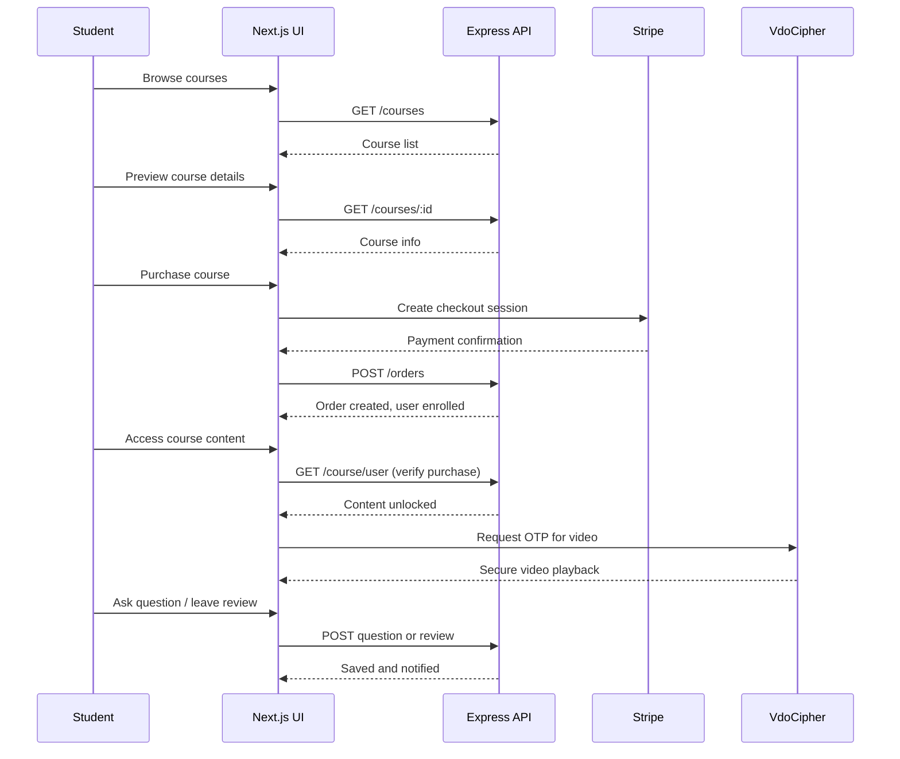
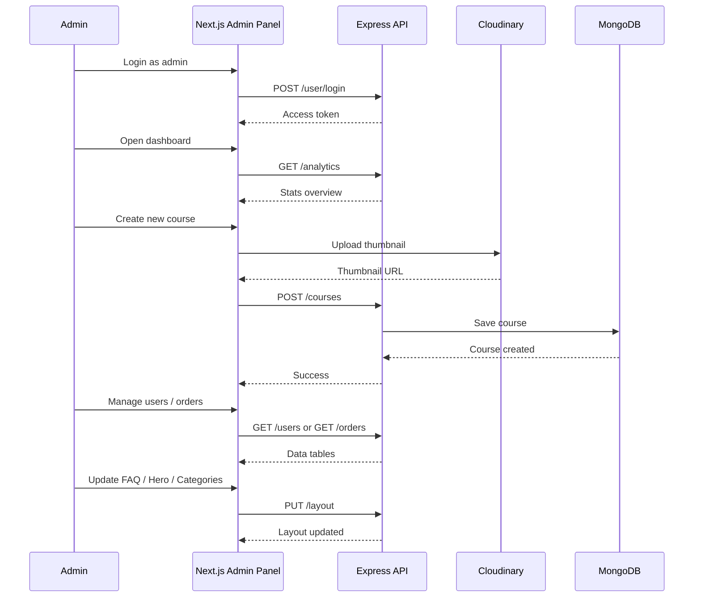

# Zone Your Learning Operations (ZYLO)


 Zylo is a Learning Management System (LMS) that connects students with teachers through structured courses. Students can browse, purchase, and access video-based courses with interactive Q&A, reviews, and real-time notifications. Admins manage content, users, and analytics through a dedicated dashboard.

## Repository

This is a monorepo containing both frontend and backend:

- `client/` — Next.js application (UI)
- `server/` — Express API (backend services)

## Goals

- Provide a multi-role platform for students and admins.
- Allow students to enroll in courses, watch DRM-protected videos, ask questions, and leave reviews.
- Enable admins to create, edit, and manage courses, users, and platform content.
- Secure course content with DRM and purchase verification.
- Deliver real-time notifications for replies, reviews, and updates.
- Offer analytics dashboards for tracking users, courses, and enrollments.
- Process secure payments via Stripe.

## Tech Stack

| Layer | Technology | Purpose |
|-------|------------|---------|
| Frontend | Next.js 16, React 19, TypeScript, Tailwind CSS 4, Redux Toolkit | SSR, responsive UI, state management |
| Auth | JWT (custom), bcryptjs, cookie-parser | Authentication and authorization |
| Backend | Express 4, TypeScript, Mongoose | REST API, business logic |
| Database | MongoDB | Persistent storage for users, courses, orders, notifications, layouts |
| Cache | Redis (ioredis) | Course data caching, session support |
| Videos | VdoCipher (DRM), Cloudinary | Secure video playback, image hosting |
| Payments | Stripe | Course purchase and checkout |
| Email | Nodemailer, EJS | Transactional emails and reply notifications |
| Real-Time | Socket.io | Live notifications and updates |
| Scheduling | node-cron | Background scheduled tasks |
| Rate Limiting | express-rate-limit | API abuse protection |

## System Architecture



## Database ERD



## User Flow

### Student Flow



### Admin Flow



## 🚀 EC2 Deployment Architecture (AWS)

This project is deployed on an AWS EC2 Ubuntu instance where both frontend and backend are containerized using Docker.

### 🖥️ EC2 Overview

- EC2 acts as the **single hosting server**
- It runs:
  - Next.js frontend container (`zylo-client`)
  - Express backend container (`zylo-server`)
- Both services communicate internally over Docker network
- External users access via public EC2 IP

---

UserBrowser --> Frontend[EC2 Frontend :3000]
Frontend --> Backend[EC2 Backend :8000]

Backend --> DB[(MongoDB Atlas)]
Backend --> Cache[(Redis / Upstash)]
Backend --> Payments[Stripe]
Backend --> Media[Cloudinary / VdoCipher]
Backend --> Email[Nodemailer]

---

## 🐳 Docker Runtime on EC2

### Docker Containers

graph TD

EC2[AWS EC2 Ubuntu Server]

EC2 --> Docker[Docker Engine]

Docker --> Client[zylo-client Container :3000]
Docker --> Server[zylo-server Container :8000]

Client --> PublicIP[Frontend http://13.60.70.223:3000]
Server --> PublicAPI[Backend http://13.60.70.223:3000:8000/api/v1]

### Request Flow

```mermaid

User[User Browser]

User --> Frontend[Next.js Frontend]

Frontend --> Backend[Express API]

Backend --> MongoDB[(MongoDB Atlas)]

Backend --> Redis[(Upstash Redis)]

Backend --> Stripe[Stripe]

Backend --> Cloudinary[Cloudinary]

Backend --> VdoCipher[VdoCipher]

Backend --> Nodemailer[Nodemailer]
```

## ⚙️ EC2 Container Management

### Check Running Containers

```bash
docker ps
```

### Start Backend

```bash
docker run -d \
  --name zylo-server \
  -p 8000:8000 \
  --env-file .env \
  mahiig/zylo-server:latest
```

### Start Frontend

```bash
docker run -d \
  --name zylo-client \
  -p 3000:3000 \
  --env-file .env \
  mahiig/zylo-client:latest
```

### Restart Containers

```bash
docker restart zylo-client
docker restart zylo-server
```

---

## 🔐 EC2 Environment Configuration

```env
PORT=8000
NODE_ENV=production
ORIGIN=http://13.53.127.99:3000
CLIENT_URL=http://13.53.127.99:3000
```

### Important Notes

- ORIGIN and CLIENT_URL must match the frontend URL.
- Backend must be running before the frontend can make API requests.
- Redis must be configured correctly before starting the server.

---

## 🔐 OAuth Configuration

### Callback URLs

```text
http://13.60.70.223:3000/api/auth/callback/google
http://13.60.70.223:8000/api/auth/callback/github
```

### NextAuth

```env
NEXTAUTH_URL=http://13.60.70.223:3000
NEXTAUTH_SECRET=your-secret
```

---

## 🌐 Production Domain (Optional)

```
yourdomain.com
        │
        ▼
AWS EC2 Public IP
```

---

## 📌 Deployment Summary

- EC2 hosts both frontend and backend.
- Docker runs both services as separate containers.
- MongoDB Atlas stores application data.
- Upstash Redis handles caching.
- Cloudinary stores images.
- VdoCipher secures video streaming.
- Stripe processes payments.

### Public URLs

Frontend

```
http://13.53.127.99:3000
```

Backend

```
http://13.60.70.223:8000/api/v1
```

Public access via:

http://13.60.70.223:3000
http://13.60.70.223:8000
OAuth must match exact callback URLs
Domain is optional but recommended for production


## API Endpoints

| Route | Description |
|-------|-------------|
| `POST /api/v1/user/register` | Register new user |
| `POST /api/v1/user/login` | Login user |
| `GET /api/v1/user/me` | Get current user profile |
| `PUT /api/v1/user/update` | Update user profile |
| `GET /api/v1/courses` | Get all courses |
| `POST /api/v1/courses` | Create new course (admin) |
| `GET /api/v1/courses/:id` | Get single course |
| `PUT /api/v1/courses/:id` | Update course (admin) |
| `GET /api/v1/course/user` | Get user-specific course content |
| `POST /api/v1/orders` | Create order after payment |
| `GET /api/v1/orders` | Get all orders (admin) |
| `GET /api/v1/notifications` | Get user notifications |
| `PUT /api/v1/notifications/:id` | Mark notification as read |
| `GET /api/v1/analytics/users` | User analytics (admin) |
| `GET /api/v1/analytics/courses` | Course analytics (admin) |
| `GET /api/v1/analytics/orders` | Order analytics (admin) |
| `GET /api/v1/layout` | Get platform layout |
| `PUT /api/v1/layout` | Update layout (admin) |


## Environment Variables

Create a `.env` file inside the `server/` directory with the following variables:

| Variable | Description |
|----------|-------------|
| `PORT` | Server port (default: 5000) |
| `MONGODB_URI` | MongoDB connection string |
| `ACCESS_TOKEN` | JWT secret for access tokens |
| `REFRESH_TOKEN` | JWT secret for refresh tokens |
| `JWT_SECRET` | General JWT secret |
| `REDIS_URL` | Redis connection string |
| `CLOUDINARY_CLOUD_NAME` | Cloudinary cloud name |
| `CLOUDINARY_API_KEY` | Cloudinary API key |
| `CLOUDINARY_API_SECRET` | Cloudinary API secret |
| `VDOCIPHER_API_SECRET` | VdoCipher API secret |
| `STRIPE_SECRET_KEY` | Stripe secret key |
| `STRIPE_PUBLISHABLE_KEY` | Stripe publishable key |
| `SMTP_HOST` | SMTP server host |
| `SMTP_PORT` | SMTP server port |
| `SMTP_USER` | SMTP username |
| `SMTP_PASS` | SMTP password |
| `CLIENT_URL` | Frontend URL for CORS |

## Deployment

- **Frontend**: Deploy the `client/` directory to Vercel.
- **Backend**: Deploy the `server/` directory to Railway, Render, or any Node.js hosting platform.
- **Database**: Use MongoDB Atlas for managed MongoDB hosting.
- **Cache**: Use Upstash Redis or Redis Cloud for managed Redis hosting.
- **Media**: Cloudinary and VdoCipher are managed externally.
- **Payments**: Configure Stripe webhook endpoints pointing to the deployed backend URL.

